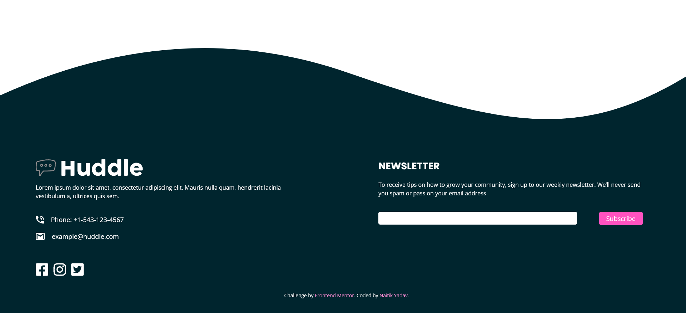

#  Huddle

This is a solution to the [Huddle landing page with curved sections challenge on Frontend Mentor](https://www.frontendmentor.io/challenges/huddle-landing-page-with-curved-sections-5ca5ecd01e82137ec91a50f2). Frontend Mentor challenges help you improve your coding skills by building realistic projects.

## Table of contents

- [Overview](#overview)
  - [The challenge](#the-challenge)
  - [Screenshots](#screenshots)
  - [Link](#link)
- [My process](#my-process)
  - [Built with](#built-with)
  - [What I learned](#what-i-learned)
  - [Continued development](#continued-development)
  - [Useful resources](#useful-resources)
- [Author](#author)

## Overview

### The challenge

Users should be able to:

- View the optimal layout for the site depending on their device's screen size
- See hover states for all interactive elements on the page

### Screenshots

#### Desktop:

#### Mobile:

### Link

- Live Site URL: [GitHub Pages](https://n4itik.github.io/Huddle/)

## My process

### Built with

- Semantic HTML5 markup
- CSS custom properties
- Flexbox
- CSS Grid
- Mobile-first workflow

### What I learned

This project enhanced my understanding of many CSS fundamentals and advanced functionalities. From variables, flex, grids to media queries and active states - this challenge tests them all.

### Continued development

The curved sections used in the webpage are made up of images and background colors. Since I couldn't figure out a way to employ `background-images` in CSS without breaking the layout or redefining the work I had accomplished, I used those assets as full-width images within the HTML itself. That is something I'd like to touch upon in future projects.

### Useful resources

- [Web Dev Simplified's Playlist](https://www.youtube.com/playlist?list=PLZlA0Gpn_vH9D0J0Mtp6lIiD_8046k3si)
- [Josh Comeau's Custom CSS Reset](https://www.joshwcomeau.com/css/custom-css-reset/)

## Author

- Frontend Mentor - [@n4itik](https://www.frontendmentor.io/profile/n4itik)
- Linktree - [Naitik Yadav](https://linktr.ee/naitikyadav)
